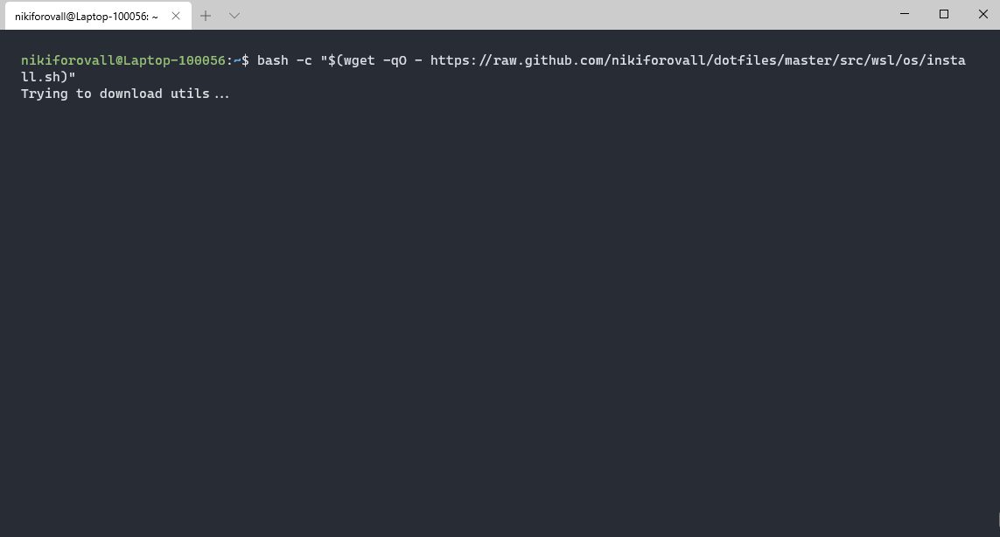
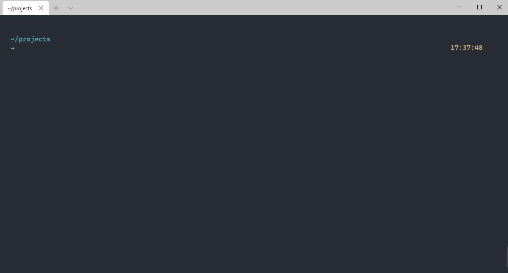

Dotfiles for Windows (Windows Terminal, WSL, ZSH)
============================================================

Facilitates development with WSL. Installs major dependencies and handy tools for .NET developer.

Goals of this setup
-------------------

- target platform: Windows 10
- visually nice terminal: Windows Terminal
- vscode: settings sync
- app-install: install essentials - tools/utilities/programs
- main shell: zsh
- shell: powershell + oh-my-posh + custom theme
- shell: git bash

Windows (PowerShell, Git Bash) # TBD
-------------------

To install `dotfiles` run the next snippet in the terminal:

| OS | Snippet |
|:---|:---|
| `Windows` | `powershell -NoProfile -ExecutionPolicy unrestricted -Command "[Net.ServicePointManager]::SecurityProtocol = [Net.SecurityProtocolType]::Tls12; &([scriptblock]::Create((Invoke-WebRequest -UseBasicParsing 'https://raw.github.com/nikiforovall/dotfiles/master/src/windows/app_install.ps1')))` |

WSL
-------------------

To install the `dotfiles` run the next snippet in the terminal:

| OS | Snippet |
|:---|:---|
| `Ubuntu` | `bash -c "$(wget -qO - https://raw.github.com/nikiforovall/dotfiles/master/src/wsl/os/install.sh)"` |

### `~/.*.local`

The `~/.gitconfig.local` file will be automatically included after the configurations from `~/.gitconfig`, thus, allowing its content to overwrite or add to the existing `Git` configurations.

__Note:__ Use `~/.gitconfig.local` to store sensitive information such as the `Git` user credentials, e.g.:

```bash
[commit]
    # Sign commits using GPG.
    # https://help.github.com/articles/signing-commits-using-gpg/
    gpgsign = true

[user]
    name = <name>
    email = <account@example.com>
    signingkey = XXXXXXXX

# https://git-scm.com/docs/gitcredentials
# https://help.github.com/en/github/collaborating-with-issues-and-pull-requests/resolving-a-merge-conflict-using-the-command-line
# https://help.github.com/en/github/authenticating-to-github/connecting-to-github-with-ssh
# [credential]
#     helper = cache
```
__Note:__ Use `~/.zshrc.local` or `bash.local` for shells.

Resources
-------------------

**Demo:** For more details please see related blog post: <https://nikiforovall.github.io/productivity/2019/11/30/nikiforovall-setup.html>





Resources
-------------------

Demo: For more details please see related blog post: <https://nikiforovall.github.io/productivity/2019/11/30/nikiforovall-setup.html>

My favorite aliases/functions:

- ddg - search in duckDuckGo browser
- evernote - login and search in evernote
- g - git
- dn - dotnet
- peek_shell_config - see configs in less
- ghpr - open github pull request page for current repo
- qh - search command history
- qt - search current directory
- q - exit
- path - list path
- map - `"xargs -n1"`
- mkd - make directory and cd
- delete-files - delete files that match a certain pattern from the current directory.
-

Credits
-------------------

Checkout out this awesome dotfile repository: <https://github.com/alrra/dotfiles>
